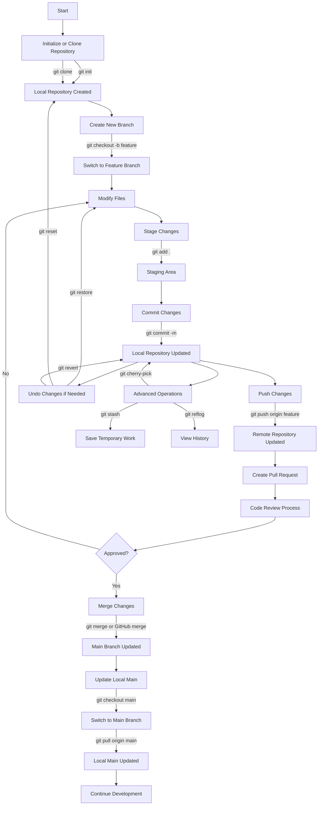

# Git Command Cheatsheet

This repository is a structured reference for commonly used Git commands and workflows. It is designed to help understand both individual commands and how they fit together in real development scenarios.

The content is divided into sections covering basic commands, branching, merging, undo operations, advanced usage, and collaboration workflows such as forking and pull requests.

---

## Repository Structure

* `basics.md` – Core commands like init, clone, add, commit
* `branching.md` – Creating, switching, and deleting branches
* `merging.md` – Merge and rebase operations
* `undo.md` – Restore, reset, and revert commands
* `advanced.md` – Stash, cherry-pick, reflog, and more
* `fork.md` – Forking repositories and syncing with upstream
* `pull_request.md` – Creating and managing pull requests
* `merge_workflow.md` – How merging works in team environments
* `cheatsheet.md` – Quick reference for daily usage

---

## Typical Git Workflow

A standard workflow followed in most projects:

1. Initialize or clone a repository
2. Create a branch for new work
3. Make changes and stage them
4. Commit changes locally
5. Push changes to a remote repository
6. Create a pull request
7. Review and merge changes
8. Update local repository

---

## Flowchart of Git Workflow with Commands

---

## Key Concepts

### Working Directory

This is where files are modified. Changes are not tracked until they are staged.

### Staging Area

Files added using `git add` are prepared for commit.

### Repository

Stores all commits, history, and project metadata.

### Branching

Allows independent development without affecting the main branch.

### Pull Request

A mechanism to propose changes and enable code review before merging.

### Merge and Rebase

Used to integrate work from different branches.

### Undo Operations

Commands like restore, reset, and revert help recover from mistakes.

---

## How to Use This Repository

* Read topic-wise files for detailed commands
* Practice commands in a local repository
* Use the cheatsheet for quick recall
* Refer to the workflow diagram to understand the full process

---

## Notes

* Commit frequently with meaningful messages
* Avoid working directly on the main branch
* Always pull the latest changes before pushing
* Be cautious with commands like `git reset --hard`

---

This repository is intended to serve as a clear and practical reference for learning and applying Git in real-world development.
