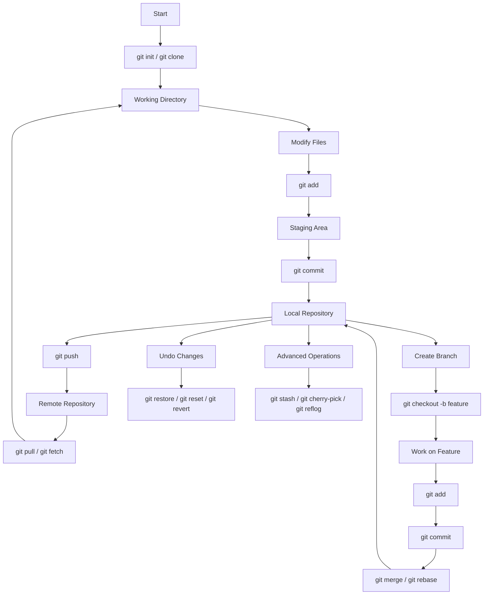

# Git Command Cheatsheet

This repository is a structured reference for commonly used Git commands. It is designed to help understand not only what each command does, but also how they fit into a real development workflow.

The content is organized into separate sections such as basics, branching, merging, undo operations, and advanced usage. Each section contains concise explanations along with example commands.

This repository can be used as:

* A quick revision guide before interviews
* A reference while working on projects
* A learning resource for understanding Git workflows

---

## Repository Structure

* `basics.md` – Core commands like init, clone, add, commit
* `branching.md` – Creating, switching, and deleting branches
* `merging.md` – Combining work using merge and rebase
* `undo.md` – Reverting and resetting changes
* `advanced.md` – Commands like stash, cherry-pick, reflog
* `cheatsheet.md` – Quick summary of commonly used commands

---

## Typical Git Workflow

In most projects, Git follows a standard cycle:

1. Create or clone a repository
2. Make changes to files
3. Stage the changes
4. Commit the changes
5. Push to a remote repository
6. Collaborate using branches and merges

---

## Flowchart of Git Workflow

---

## Key Concepts

### Working Directory

This is where you edit your files. Any changes here are not tracked until staged.

### Staging Area

Files added using `git add` are prepared for the next commit.

### Repository

The `.git` directory stores all commits, history, and metadata.

### Branching

Branches allow parallel development without affecting the main codebase.

### Merging and Rebasing

Used to integrate changes from different branches.

### Undo Operations

Commands like restore, reset, and revert help recover from mistakes.

---

## How to Use This Repository

1. Read each section file based on the topic
2. Try commands in a test repository
3. Refer to the cheatsheet for quick recall
4. Use the flowchart to understand the overall process

---

## Notes

* Always commit frequently with meaningful messages
* Avoid working directly on the main branch
* Pull changes before pushing to avoid conflicts
* Be cautious with commands like `reset --hard`

---

This repository is meant to build a clear mental model of how Git works in real development scenarios.
