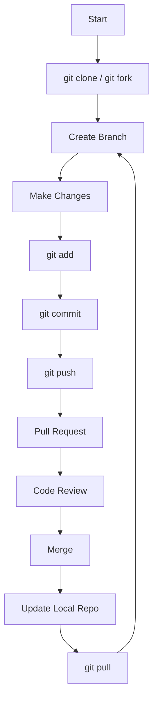

# Git Command Cheatsheet

This repository is a structured reference for commonly used Git commands and workflows. It is intended to provide a clear understanding of how Git is used in real development environments.

The content is divided into focused sections, each covering a specific aspect of Git such as basic commands, branching, merging, undo operations, advanced usage, and collaboration workflows like forking and pull requests.

---

## Repository Structure

* `basics.md` – Core commands like init, clone, add, commit
* `branching.md` – Creating, switching, and deleting branches
* `merging.md` – Merge and rebase operations
* `undo.md` – Restore, reset, and revert commands
* `advanced.md` – Stash, cherry-pick, reflog, and more
* `fork.md` – Forking repositories and upstream sync
* `pull_request.md` – Creating and managing pull requests
* `merge_workflow.md` – How merging works in teams
* `cheatsheet.md` – Quick reference for daily use

---

## Typical Git Workflow

A typical development workflow using Git looks like this:

1. Clone or fork a repository
2. Create a new branch for your work
3. Make changes and commit them
4. Push changes to your repository
5. Create a pull request
6. Review and merge changes

---

## Flowchart of Git Workflow

---

## Key Concepts

### Repository

Stores project history, commits, and metadata.

### Branch

Allows independent development without affecting the main codebase.

### Commit

A snapshot of changes saved in the repository.

### Pull Request

A way to propose and review changes before merging.

### Merge

Combines changes from one branch into another.

---

## Usage

* Refer to individual files for specific commands
* Practice commands in a test repository
* Use the cheatsheet for quick revision
* Follow the workflow diagram for better understanding

---

## Notes

* Commit frequently with meaningful messages
* Use branches for all new features or fixes
* Sync regularly with the main repository
* Be cautious with destructive commands like `reset --hard`

---

This repository is intended to serve as both a learning guide and a long-term reference for Git usage.
